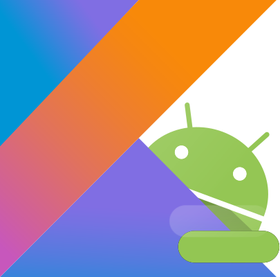

# Hola gente 👋

Nice to meet you. My name is Pablo. I am a mechanical design engineer. Computer programming is one of my biggest hobbies (the others being 3D CAD 📐, learning new cultures and meeting friends).

Currently I am very interested in Android development (both the technical aspect and the design aspect). My goal is to be able to enjoy and develop my own Android apps while I step up in the game . 

If you do not mind, I will use this *README* to write down all my journey.
 
---

#### 
 My learning path to become a `self-taught Android Developer`. 👨‍🎓 

#### - Courses ⚙️📲
1. [Jetbrains Academy](https://hyperskill.org/tracks/3) - _Kotlin developer path_ 

   * EASY DIFFICULTY
        1. [x] Simply chatty bot
        2. [x] Simply search engine

   * MEDIUM DIFFICULTY
        1. [x] Smart calculator
        2. [x] Minesweeper
        3. [x] Unit converter
        4. [x] Coffee Machine

   * HARD DIFFICULTY
        1. [x] Smart calculator
        2. [x] Simply search engine
        3. [x] Numeric matrix processor
        4. [x] Phone book
        5. [x] Parking lot

   * Challenging
        1. [x] Flashcards

2. [Kotlin Bootcamp for Programmers](https://developer.android.com/courses/kotlin-bootcamp/overview) - _Google Developers Codelabs_    
    1. [x] Lesson 1: Get started
    2. [x] Lesson 2: Kotlin basics
    3. [ ] Lesson 3: Functions
    4. [ ] Lesson 4: Classes and objects
    5. [ ] Lesson 5.1: Extensions
    6. [ ] Lesson 5.2: Generics
    7. [ ] Lesson 6: Functional manipulation

...WIP 👷🏻...

